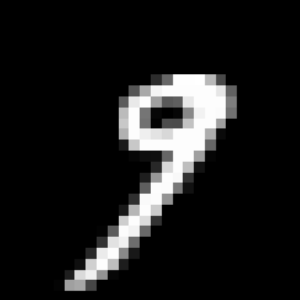
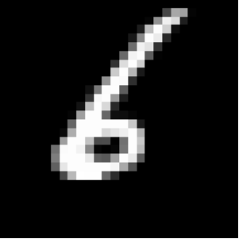
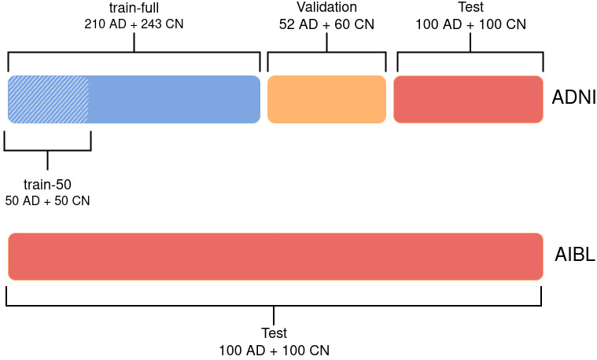
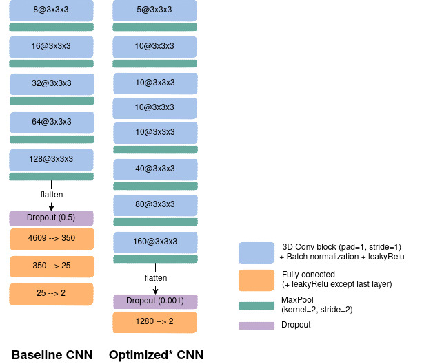
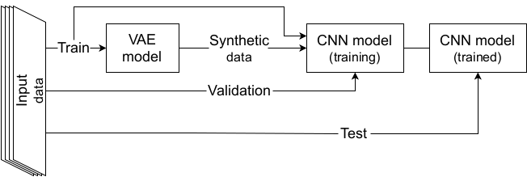
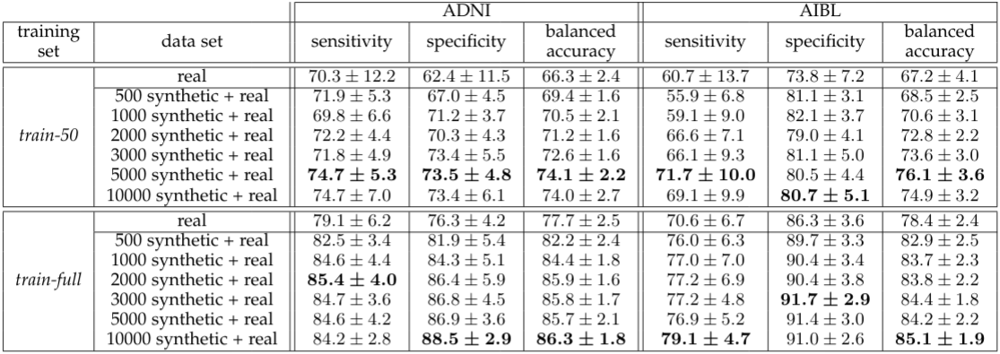
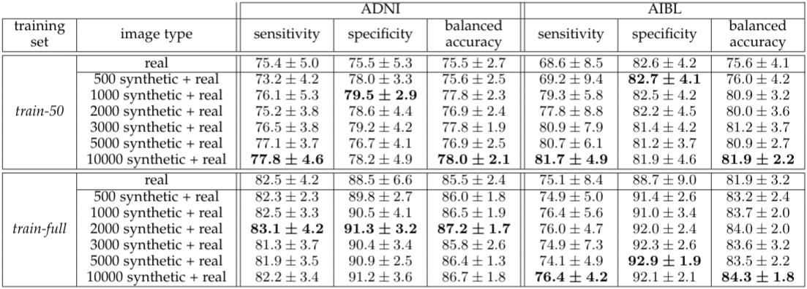

###############################
Background
###############################

************************************************
Why data augmentation ?
************************************************

Even though always larger data sets are now available, the lack of labeled data remains a tremendous issue in many fields of application. Among others, a good example is healthcare where practitioners have to deal most of the time with (very) low sample sizes (think of small patient cohorts) along with very high dimensional data (think of neuroimaging data that are 3D volumes with millions of voxels). Unfortunately, this leads to a very poor representation of a given population and makes classical statistical analyses unreliable. Meanwhile, the remarkable performance of algorithms heavily relying on the deep learning framework has made them extremely attractive and very popular. However, such results are strongly conditioned by the number of training samples since such models usually need to be trained on huge data sets to prevent over-fitting or to give statistically meaningful results. A way to address such issues is to perform Data Augmentation (DA) which consists in creating synthetic samples to enrich an initial data set and allow machine learning algorithm to better generalize on unseen data. For instance, the easiest way to do this on images is to apply simple transformations such as the addition of Gaussian noise, cropping or padding, and assign the label of the initial image to the created ones. 

************************************************
Limitations of classic DA
************************************************
While such augmentation techniques have revealed very useful, they remain strongly data dependent and limited. Some transformations may indeed be uninformative or even induce bias. 

.. centered::
    |pic1| apply rotation |pic2|

For instance, think of a digit representing a 6 which gives a 9 when rotated. While assessing the relevance of augmented data may be quite straightforward for simple data sets, it reveals very challenging for complex data and may require the intervention of an *expert* assessing the degree of relevance of the proposed transformations. 

************************************************
Generative models: A new hope
************************************************

The recent rise in performance of generative models such as GAN or VAE has made them very attractive models to perform DA. However, the main limitation to a wider use of these models is that they most of the time produce blurry and fuzzy samples. This undesirable effect is even more emphasized when they are trained with a small number of samples which makes them very hard to use in practice to perform DA in the high dimensional (very) low sample size (HDLSS) setting.

**This is why Pyraug was born!**

************************************************
A Flavour of Pyraug's Results
************************************************

Case Study 1: Classification on 3D MRI (ADNI & AIBL) 
===================================================== 

A :class:`~pyraug.models.RHVAE` model was used to perform Data Augmentation in the High Dimensional Low Sample Size Setting on 3D MRI neuroimaging data from ADNI (http://adni.loni.usc.edu/) and AIBL (https://aibl.csiro.au/) database. The model was used to try to enhance the classification task consisting in finding Alzheimer's disease patients (AD) from Cognitively Normal participants (CN) using T1-weighted MR images :cite:p:`chadebec_data_2021`.

Classification set up
-------------------------------------------------------

Data Splitting
~~~~~~~~~~~~~~~~~~~~~~~~~~~~~~~~~~~~~~~~~~~~~~~~~~~~~~~

The ADNI data set was split into 3 sets: train, validation and test.
First, the test set was created using 100 randomly chosen participants for each diagnostic label (i.e. 100 CN, 100 AD). The rest of the data set was split such that 80% is allocated from training and 20% for validation. The authors ensured that age, sex and site distributions between the three sets were not significantly different. The train set is referred to as *train-full* in the following.

In addition, a smaller training set (denoted as *train-50*) was extracted from *train-full*. This set comprised only 50 images per diagnostic label, instead of 243 CN and 210 AD for *train-full*. It was ensured that age and sex distributions between *train-50* and *train-full* were not significantly different. This was not done for the site distribution as there are more than 50 sites in the ADNI data set (so they could not all be represented in this smaller training set). The AIBL data was **never used for training** or hyperparameter tuning and was only used as an **independent** test set.

.. centered::
    |pic3|
    Data Split for the classification task: Alzheimer Disease (AD) vs. Cognitively Normal (CN)

Data Processing
~~~~~~~~~~~~~~~~~~~~~~~~~~~~~~~~~~~~~~~~~~~~~~~~~~~~~~~

All the data was processed as follows:

    - Raw data are converted to the BIDS standard :cite:p:`gorgolewski_brain_2016`,
    - Bias field correction is applied using N4ITK :cite:p:`tustison_n4itk_2010`,
    - T1w images are linearly registered to the MNI standard space :cite:p:`fonov_unbiased_2009,fonov_unbiased_2011` with ANTS :cite:p:`avants_insight_2014` and cropped. This produced images of size 169x208x179 with :math:`1~\mathrm{mm}^{3}` isotropic voxels.
    - An automatic quality check is performed using an open-source pretrained network :cite:p:`fonov_deep_2018`. All images passed the quality check.
    - NIfTI files are converted to tensor format.
    - (Optional) Images are down-sampled using a trilinear interpolation, leading to an image size of 84x104x89.
    - Intensity rescaling between the minimum and maximum values of each image is performed. 

Classifier
~~~~~~~~~~~~~~~~~~~~~~~~~~~~~~~~~~~~~~~~~~~~~~~~~~~~~~~
To perform such classification task a CNN was used with two different paradigms to choose the architecture. First, the authors reused the same architecture as in :cite:p:`wen_convolutional_2020` which was obtained by optimizing manually the networks on the ADNI data set for the same task (AD vs CN). A slight adaption was done for the down-sampled images, which consisted in resizing the number of nodes in the fully-connected layers to keep the same ratio between the input and output feature maps in all layers. This  architecture is denoted **baseline**. Secondly, a random search was launched  :cite:p:`bergstra_random_2012` allowing to explore different hyperperameter values. The hyperparameters explored for the architecture were the number of convolutional blocks, of filters in the first layer and of convolutional layers in a block, the number of fully-connected layers and the dropout rate. Other hyperparameters such as the learning rate and the weight decay were also part of the search. 100 different random architectures were trained on the 5-fold cross-validation done on *train-full*. For each input, the selected  architecture is the one that obtained the best mean balanced accuracy across the validation sets of the cross-validation. This architecture is referred to as **optimized**.

.. centered::
    |pic4|
    CNN architectures: *left*: The baseline net. *right*: The optimized one using a random search across 100 architectures.

Augmentation Set up
-------------------------------------------------------

On the meantime, a :class:`~pyraug.models.RHVAE` was trained on each class of the train sets (*train-50* or *train-full*) to be able to generate new synthetic data. Noteworthy is the fact that the VAE and the CNN shared the **same training set** and no augmentation was performed on the validation set or the test set.

.. centered::
    |pic5|
    Data Augmentation scheme with a VAE.

Then the **baseline** (resp. **optimized**) CNN networks were then trained for 100 (resp. 50) epochs using the cross entropy loss for training and validation losses. Balanced accuracy was also computed at the end of each epoch. The models were trained on either 1) only the *real* images; 2) only the synthetic samples created by the :class:`~pyraug.models.RHVAE` or 3) the augmented training set (*real* + synthetic) on 20 independent runs for each experiment. The final model  was chosen as the one that obtained the highest validation balanced accuracy during training.  

Results
-------------------------------------------------------

Below are presented some of the main results obtained in this case study. We refer the reader to :cite:p:`chadebec_data_2021` for the full results of the study.

.. centered::
    |pic6|
    Augmentation results with the **baseline** CNN network.

.. centered::
    |pic7|
    Augmentation results with the **optimized** CNN network.

The proposed method allowed for a significant gain in the model classification results even when the CNN was optimized on the real data only (random search not performed for augmented data set) and even though small size data sets were considered along with very challenging high dimensional data.

.. bibliography::