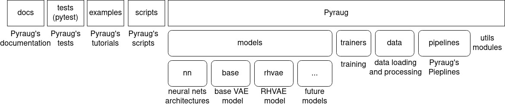

##################################
Getting started
##################################

************************************************
Description
************************************************

This library provides a way to perform Data Augmentation using Variational Autoencoders in a 
reliable way even in challenging contexts such as high dimensional and low sample size 
data.

************************************************
Installation
************************************************

To install the library run the following using ``pip``

.. code-block:: bash

    $ pip install pyraug 

or alternatively you can clone the github repo to access to tests, tutorials and scripts.

.. code-block:: bash

    $ https://github.com/clementchadebec/pyraug.git

************************************************
Pyraug's spirit & overview
************************************************

The Pyraug's library organizes as follows

.. centered::
    |pic3|
    Pyraug's overview

If you clone the Pyraug's repository you will access to  the following:

- ``docs``: The folder in which the documentation can be retrieved.
- ``tests``: Pyraug's unit-testing using pytest.
- ``examples``: A list of ``ipynb`` tutorials describing the main functionalities of Pyraug.
- ``pyraug``: The main library which can be installed with ``pip``.

In the main library, you will access to the following modules:

- :ref:`pyraug.models`: This is the module where any Variational Autoencoder model is implemented. It is composed of:

    - :ref:`pyraug.models.nn`: The module gathers all the neural networks architectures for the encoders, decoders and metrics networks (if applicable) used within the models.
    - pyraug.models.base: This is the base module of the VAE models.
    - pyraug.models.other_model: By convention, each implemented model is contained within a folder located in :ref:`pyraug.models` in which are located 4 modules:

        - *model_config.py*: Contains a :class:`OtherModelConfig` instance inheriting from :class:`~pyraug.models.base.BaseModelConfig` where the model configuration is stored and a :class:`OtherModelSamplerConfig` instance inheriting from :class:`~pyraug.models.base.BaseSamplerConfig` where the configuration of the sampler used to generate new samples is defined.
        - *other_model_model.py*: An implementation of the other_model inheriting from :class:`~pyraug.models.BaseVAE`.
        - *other_model_sampler.py*: An implementation of the sampler(s) to use to generate new data inheriting from :class:`~pyraug.models.base.base_sampler.BaseSampler`.
        - *other_model_utils.py*: A module where utils methods are stored.

- :ref:`pyraug.trainer`: This module contains the main function to perform a model training. In particular, it gathers a :class:`~pyraug.trainers.training_config.TrainingConfig` instance stating any training parameters and a :class:`~pyraug.trainers.Trainer` instance used to train the model.
- :ref:`pyraug.data`: Here are located the modules allowing to load, pre-process and convert the data to types handled by Pyraug. 
- :ref:`pyraug.pipelines`: In this module can be found Pyraug's Pipelines. These are functions that allows a user to combine several Pyraug's modules together.

Please see the full module description for further details.

************************************************
Augmenting your Data
************************************************

In Pyraug, a typical augmentation process is divided into 2 distinct parts:

    - Training a model using the Pyraug's :class:`~pyraug.pipelines.TrainingPipeline` or using the provided ``scripts/training.py`` script
    - Generating new data from a trained model using Pyraug's :class:`~pyraug.pipelines.GenerationPipeline` or using the provided ``scripts/generation.py`` script

There exist two ways to augment your data pretty straightforwardly using Pyraug's built-in functions. 

    

Using the provided scripts
=================================================

Pyraug provides two scripts allowing you to augment your data directly with commandlines.

.. note::
    To access to the predefined scripts you should first clone the Pyraug's repository.
    The following scripts are located in ``pyraug/scripts`` folder. For the time being, only :class:`~pyraug.models.RHVAE` model training and generation is handled by the provided scripts. Models will be added as they are implemented in :ref:`pyraug.models` 

Launching a model training:
--------------------------------------------------

To launch a model training, run 

.. code-block:: bash

    $ python scripts/training.py --path_to_train_data "path/to/your/data/folder" 

The data must be located in ``path/to/your/data/folder`` where each input data is a file. Handled image types are ``.pt``, ``.nii``, ``.nii.gz``, ``.bmp``, ``.jpg``, ``.jpeg``, ``.png``. Depending on the usage, other types will be progressively added.

At the end of training, the model weights ``models.pt`` and model config ``model_config.json`` file 
will be saved in a folder ``outputs/my_model_from_script/training_YYYY-MM-DD_hh-mm-ss/final_model``. 

.. tip::
   In the simplest configuration, default ``training_config.json`` and ``model_config.json`` are used (located in ``scripts/configs`` folder). You can easily override these parameters by defining your own ``.json`` file and passing them to the parser arguments.

    .. code-block:: bash

        $ python scripts/training.py 
            --path_to_train_data 'path/to/your/data/folder'
            --path_to_model_config 'path/to/your/model/config.json'
            --path_to_training_config 'path/to/your/training/config.json'

    See :ref:`setting your config` and tutorials for a more in depth example.

.. note::
    For high dimensional data we advice you to provide you own network architectures. With the 
    provided MLP you may end up with a ``MemoryError``.

Launching data generation:
--------------------------------------------------

Then, to launch the data generation process from a trained model, you only need to run 

.. code-block:: bash

    $ python scripts/training.py --num_samples 10 --path_model_folder 'path/to/your/trained/model/folder' 

The generated data is stored in several ``.pt`` files in ``outputs/my_generated_data_from_script/generation_YYYY-MM-DD_hh_mm_ss``. By default, it stores batch data of 500 samples.

.. tip::
    In the simplest configuration, default ``sampler_config.json`` is used. You can easily override these parameters by defining your own ``.json`` file and passing it the to the parser arguments.

    .. code-block:: bash

        $ python scripts/training.py 
            --path_to_train_data 'path/to/your/data/folder'
            --path_to_sampler_config 'path/to/your/training/config.json'
        
    See :ref:`setting your config` and tutorials for a more in depth example.

.. _retrieve-generated-data:

Retrieve generated data
--------------------------------------------------

Generated data can then be loaded pretty easily by running

.. code-block:: python

    >>> import torch
    >>> data = torch.load('path/to/generated_data.pt')

Using Pyraug's Pipelines
=================================================

Pyraug also provides two pipelines that may be uses to either train a model on your own data or generate new data with a pretrained model.

.. tip::
    These pipelines are independent of the choice of the model and sampler. Hence, they can be used even if you want to access to more advanced feature such as defining your own autoencoding architecture. 

Launching a model training
--------------------------------------------------

To launch a model training, you only need to call a :class:`~pyraug.pipelines.TrainingPipeline` instance. 
In its most basic version the :class:`~pyraug.pipelines.TrainingPipeline` can be built without any arguments.
This will by default train a :class:`~pyraug.models.RHVAE` model with default autoencoding architecture and parameters.

.. code-block:: python

    >>> from pyraug.pipelines import TrainingPipeline
    >>> pipeline = TrainingPipeline()
    >>> pipeline(train_data=dataset_to_augment)

where ``dataset_to_augment`` is either a :class:`numpy.ndarray`, :class:`torch.Tensor` or a path to a folder where each file is a data (handled data format are ``.pt``, ``.nii``, ``.nii.gz``, ``.bmp``, ``.jpg``, ``.jpeg``, ``.png``). 

More generally, you can instantiate your own model and train it with the :class:`~pyraug.pipelines.TrainingPipeline`. For instance, if you want to instantiate a basic :class:`~pyraug.models.RHVAE` run:

.. code-block:: python
    
    >>> from pyraug.models import RHVAE
    >>> from pyraug.models.rhvae import RHVAEConfig
    >>> model_config = RHVAEConfig(
    ...    input_dim=int(intput_dim)
    ... ) # input_dim is the shape of a flatten input data
    ...   # needed if you do not provided your own architectures
    >>> model = RHVAE(model_config)

In case you instantiate yourself a model as shown above and you do not provided all the network architectures (encoder, decoder & metric if applicable), the :class:`ModelConfig` instance will expect you to provide the input dimension of your data which equals to ``n_channels x height x width x ...``. Pyraug's VAE models' networks indeed default to Multi Layer Perceptron neural networks which automatically adapt to the input data shape. Hence, if you do not provided any input dimension an error is raised:

.. code-block:: python

    >>> from pyraug.models.base.base_config import BaseModelConfig
    >>> from pyraug.models import BaseVAE
    >>> config = BaseModelConfig()
    >>> BaseVAE(model_config=config)
        Traceback (most recent call last):
          File "<stdin>", line 1, in <module>
          File "/home/clement/Documents/these/implem/pyraug/src/pyraug/models/base/base_vae.py", line 57, in __init__
            raise AttributeError("No input dimension provided !"
        AttributeError: No input dimension provided !'input_dim' parameter of 
            BaseModelConfig instance must be set to 'data_shape' where the shape of the data is [mini_batch x data_shape] . Unable to build encoder automatically

.. note::

    In case you have different size of data, Pyraug will reshape it to the minimum size ``min_n_channels x min_height x min_width x ...``

Then the :class:`~pyraug.pipelines.TrainingPipeline` can be launched by running:

.. code-block:: python

    >>> from pyraug.pipelines import TrainingPipeline
    >>> pipe = TrainingPipeline(model=model)
    >>> pipe(train_data=dataset_to_augment)

At the end of training, the model weights ``models.pt`` and model config ``model_config.json`` file 
will be saved in a folder ``outputs/my_model_from_script/training_YYYY-MM-DD_hh-mm-ss/final_model``. 

.. tip::
    In the simplest configuration, defaults training and model parameters are used. You can easily override these parameters by instantiating your own :class:`~pyraug.trainers.training_config.TrainingConfig` and :class:`~pyraug.models.base.base_config.ModelConfig` file and passing them the to the :class:`~pyraug.pipelines.TrainingPipeline`.

    Example for a :class:`~pyraug.models.RHVAE` run:

    .. code-block:: python

        >>> from pyraug.models import RHVAE
        >>> from pyraug.model.rhvae import RHVAEConfig
        >>> from pyraug.trainers.training_config import TrainingConfig
        >>> from pyraug.pipelines import TrainingPipeline
        >>> custom_model_config = RHVAEConfig(
        ...    input_dim=input_dim, *my_args, **my_kwargs
        ... ) # Set up model config
        >>> model = RHVAE(
        ...     model_config=custom_model_config
        ... ) # Build model
        >>> custom_training_config = TrainingConfig(
        ...    *my_args, **my_kwargs
        ... ) # Set up training config
        >>> pipe = TrainingPipeline(
        ...    model=model, training_config=custom_training_config
        ... ) # Build Pipeline
        
    See :ref:`setting your config` and tutorials for a more in depth example.

.. note::
    For high dimensional data we advice you to provide you own network architectures. With the 
    provided MLP you may end up with a ``MemoryError``.

Launching data generation
--------------------------------------------------

To launch the data generation process from a trained model, run the following.

.. code-block:: python

    >>> from pyraug.pipelines import GenerationPipeline
    >>> model = MODEL.load_from_folder(
    ...     'path/to/your/trained/model'
    ... ) # reload the model
    >>> pipe = GenerationPipeline(
    ...    model=model
    ... ) # define pipeline
    >>> pipe(samples_number=10) # This will generate 10 data points

The generated data is in ``.pt`` files in ``dummy_output_dir/generation_YYYY-MM-DD_hh-mm-ss``. By default, it stores batch data of 500 samples.

.. note::

    A model can be easily reloaded from a folder using the classmethod :class:`~pyraug.models.BaseVAE.load_from_folder` that is defined for each model implemented in pyraug and allows to load a model directly from a given folder. 

.. tip::
   In the simplest configuration, defaults sampler parameters are used. You can easily override these parameters by instantiating your own :class:`~pyraug.models.base.SamplerConfig` and passing it the to the :class:`~pyraug.pipelines.GenerationPipeline`.
   
   Example for a :class:`~pyraug.models.rhvae.RHVAESampler` run:

    .. code-block:: python

        >>> from pyraug.models.rhvae import RHVAESampler
        >>> from pyraug.models.rhvae import RHVAESamplerConfig
        >>> from pyraug.pipelines import GenerationPipeline
        >>> custom_sampler_config = RHVAESamplerConfig(
        ...    *my_args, **my_kwargs
        ... ) # Set up sampler config
        >>> custom_sampler = RHVAESampler(
        ...     model=model, sampler_config=custom_sampler_config
        ... ) # Build sampler
        >>> pipe = generationPipeline(
        ...    model=model, sampler=custom_sampler
        ... ) # Build Pipeline
        
    See :ref:`setting your config` and tutorials for a more in depth example.

Generated data can then be loaded pretty as explained in :ref:`retrieve-generated-data`

